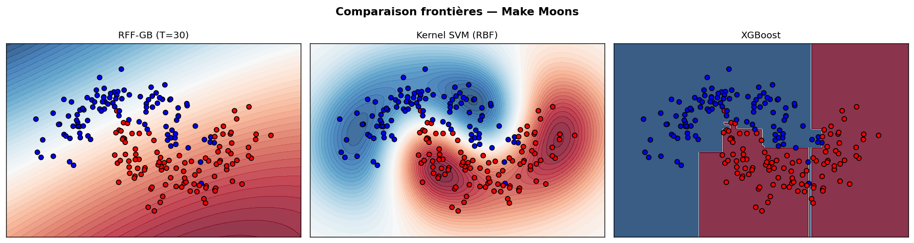
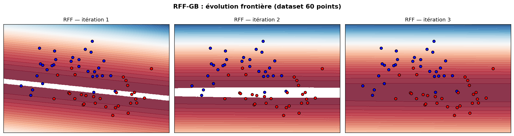
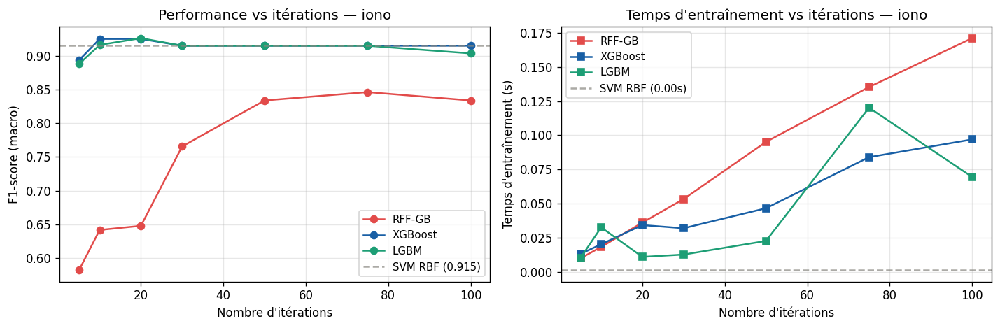
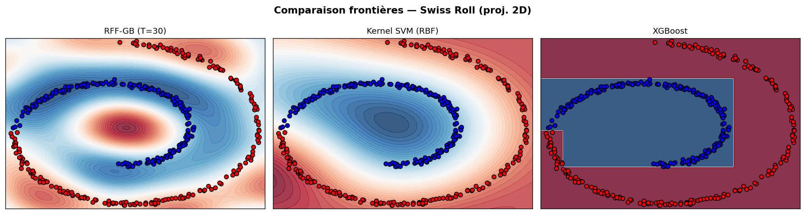

# Ensemble Methods in Machine Learning — M2 MALIA

> **A comprehensive comparative study of ensemble learning methods, featuring a novel algorithm combining Gradient Boosting with Random Fourier Features (RFF-GB) for scalable kernel approximation.**

<p align="center">
  
</p>

---

## Table of Contents

- [Overview](#overview)
- [Key Contribution — RFF-GB Algorithm](#key-contribution--rff-gb-algorithm)
- [Datasets](#datasets)
- [Methods Compared](#methods-compared)
- [Experimental Results](#experimental-results)
- [Project Structure](#project-structure)
- [How to Run](#how-to-run)
- [Authors](#authors)

---

## Overview

This project conducts an in-depth comparative analysis of **seven ensemble learning families** on **25 heterogeneous UCI classification datasets**, covering a wide range of sizes (n = 160 to 6,435), dimensionalities (d = 4 to 90), and class imbalance ratios (IR up to 130).

The study addresses two core challenges found in real-world ML pipelines:

- **Class imbalance** — datasets with IR ≥ 3, evaluated with three training modes: vanilla, oversampling, and cost-sensitive weighting
- **Data heterogeneity** — datasets spanning continuous, categorical, and mixed feature spaces

Performance is measured using **Stratified 5-Fold Cross-Validation** with F1-score (macro for balanced sets, minority-class binary F1 for imbalanced ones), with StandardScaler applied inside each fold to prevent data leakage.

---

## Key Contribution — RFF-GB Algorithm

The main algorithmic contribution is **RFF-GB** (Random Fourier Features Gradient Boosting), a novel hybrid that approximates kernel methods within a boosting framework.

### Motivation

Kernel SVMs produce expressive, smooth decision boundaries, but scale as **O(n²)** in memory and **O(n³)** in computation. RFF-GB achieves a similar approximation quality in **O(nd) per iteration**, using Bochner's theorem to represent shift-invariant kernels as expectations over cosine features.

### How It Works

At each boosting iteration *t*, RFF-GB:

1. Computes exponential weights `wᵢ = exp(−yᵢ Hₜ₋₁(xᵢ))` (harder samples get higher weight)
2. Draws an initial frequency `ω ~ N(0, 2γI)` from the Gaussian kernel's spectral density
3. **Learns a landmark** `xᵗ` by minimising the exponential loss over pseudo-residuals (via L-BFGS-B)
4. **Learns the frequency** `ωᵗ` by solving a regularised optimisation problem (ridge penalty on high frequencies)
5. Computes the weak learner weight `αᵗ` in closed form (analogous to AdaBoost)
6. Updates the model additively: `Hₜ(x) = Hₜ₋₁(x) + αᵗ cos(ωᵗ · (x − xᵗ))`

The final classifier is:

```
F(x) = H₀ + Σₜ αᵗ · cos(ωᵗ · (x − xᵗ))
```

Unlike classical RFF which samples frequencies randomly, **RFF-GB learns both landmarks and frequencies adaptively**, accelerating convergence toward the kernel approximation.

### Decision Boundary Evolution

<p align="center">
  
</p>

*Iterations 1–3 on make_moons (60 points, noise=0.2): the boundary progressively curves from a planar hyperplane to a non-linear contour, illustrating the sequential error-correction principle of boosting.*

---

## Datasets

25 binary classification datasets from the **UCI Repository**, split into two groups:

| Group | Criterion | Metric | Count |
|-------|-----------|--------|-------|
| **A** — Balanced | IR < 3 | F1-score macro | 10 |
| **B** — Imbalanced / Multiclass | IR ≥ 3 | F1-score (minority class) | 15 |

Notable datasets: `abalone8/17/20`, `spambase`, `satimage`, `wdbc`, `iono`, `sonar`, `libras`, `yeast3`, `wine4`, among others.

---

## Methods Compared

| Method | Type | Key Hyperparameters |
|--------|------|---------------------|
| Logistic Regression (ℓ2) | Baseline | C = 1 |
| Bagging | Variance reduction | T = 50 base learners |
| Random Forest | Variance reduction | T = 100 trees, √d features/node |
| AdaBoost | Sequential boosting | T = 50, depth-1 stumps |
| Gradient Boosting | Functional gradient descent | T = 100, binomial deviance |
| Stacking | Meta-learning | SVM + kNN + RF → Logistic meta |
| XGBoost | 2nd-order GB | T = 100, L1/L2 regularisation |
| LightGBM | Leaf-wise GB | T = 100, histogram-based |
| **RFF-GB** *(ours)* | Kernel boosting | T = 30, γ = 1, λ = 1 |

---

## Experimental Results

### Performance vs. Iterations (dataset: `iono`)

<p align="center">
  
</p>

- RFF-GB converges rapidly and plateaus around **T = 30–50**, justifying the default choice of T = 30
- XGBoost and LightGBM reach their performance ceiling faster (~T = 20) with lower variance
- LightGBM is **10 to 50× faster** per iteration due to histogram-based tree construction

### Gradient-Based Methods — Summary Table (vanilla mode, 5-fold CV)

| Method | Average F1 | Average Rank |
|--------|-----------|--------------|
| LightGBM | 70.3 ± 31.5 | **1.80** |
| XGBoost | 71.7 ± 31.7 | **1.96** |
| GradBoost (sklearn) | 71.2 ± 31.9 | 2.16 |
| **RFF-GB** *(ours)* | 34.8 ± 34.8 | 3.64 |

RFF-GB is **competitive on balanced, quasi-spherical datasets** (e.g., `iono`, `wdbc`, `heart`) where Gaussian kernel approximation is a good fit. It underperforms on datasets with complex feature interactions (e.g., `spambase`, `pageblocks`) and on highly imbalanced datasets (IR > 10), where the exponential initialisation creates a strong class-prior bias.

### Decision Boundaries — Swiss Roll (2D)

<p align="center">
  
</p>

*Left to right: RFF-GB, Kernel SVM (RBF), XGBoost. RFF-GB produces smooth, curved boundaries comparable to the kernel SVM, while XGBoost produces axis-aligned step boundaries.*

---

## Project Structure

```
.
├── main_project.py           # Main pipeline: data loading, CV, all ensemble methods + RFF-GB
├── generate_table_gradient.py # Generates comparison tables for gradient-based methods
├── prepdata.py               # Dataset preprocessing and loading utilities
├── results_section2.csv      # Full cross-validation results across all datasets and methods
├── table_gradient.tex        # LaTeX table for gradient-based comparison (Section 3.7)
├── fig_few_points_iterations.png   # RFF-GB boundary evolution (iterations 1–3)
├── fig_moons_comparison.png        # Boundary comparison on make_moons
├── fig_swissroll_comparison.png    # Boundary comparison on Swiss Roll (2D)
├── fig_perf_vs_iters_iono.png      # F1-score & training time vs. iterations
├── datasets/                 # UCI datasets (raw files)
└── Scripts/                  # Utility and experimental scripts
```

---

## How to Run

### Requirements

```bash
pip install numpy pandas scikit-learn xgboost lightgbm scipy matplotlib
```

### Run the full pipeline

```bash
python main_project.py
```

This runs the Stratified 5-Fold CV for all methods on all 25 datasets, saves results to `results_section2.csv`, and generates all figures.

### Generate the gradient methods comparison table

```bash
python generate_table_gradient.py
```

Outputs `table_gradient.tex` (LaTeX-ready) and prints the ranked summary to stdout.

---

## Authors

**Maram NASR** & **Skander HAJ MABROUK**
M2 MALIA — Université Lumière Lyon 2
Supervised by **Guillaume METZLER**
Academic Year 2025–2026
